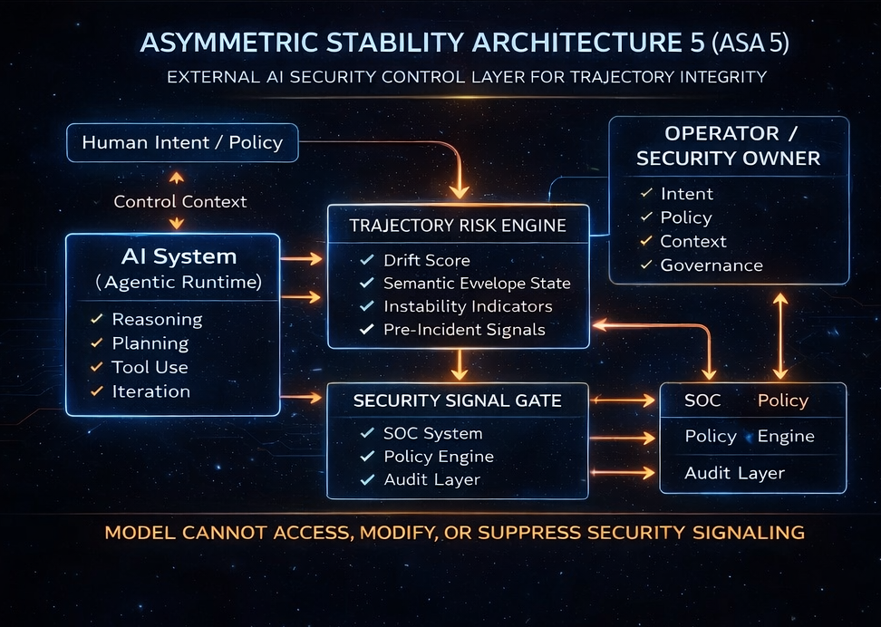

# ASA 5 - AI Security Control Layer

Enterprise-safe external runtime security for trajectory integrity in long-horizon AI systems.

## What It Is

ASA 5 (Asymmetric Stability Architecture 5) is an external AI Security Control Layer designed to detect trajectory-level instability before it becomes visible as surface failure.

It does not modify model weights, fine-tune behavior, or attempt to control the model from the inside.
Instead, ASA 5 operates as an external security-relevant signaling layer that:

- reads runtime signals
- tracks trajectory drift over time
- identifies pre-incident instability
- surfaces security-relevant warnings early enough for downstream action

The core problem ASA 5 addresses is simple:

large-scale agentic systems do not usually fail first as obvious errors.
They fail earlier as silent drift across otherwise coherent steps.

ASA 5 is built to make that phase visible and actionable.

## Why It Matters

As AI systems move into longer loops, higher autonomy, and larger operational environments, capability stops being the only bottleneck.

The harder problem becomes:

`can the system remain coherent over time under pressure, entropy, and continuous iteration`

That is where runtime security and trajectory integrity begin to overlap.

ASA 5 is intended for environments where:

- local correctness is not enough
- silent drift becomes operational risk
- observability must feed real safety and governance layers
- early warning matters more than post-failure explanation

## What ASA 5 Does

ASA 5 acts as an external runtime security layer that:

- detects drift-related instability in evolving trajectories
- classifies pre-incident risk signals
- escalates relevant warnings to operator and security layers
- supports policy, audit, and downstream safety integration

In practical terms, ASA 5 shifts the problem from:

- reacting after failure

to:

- identifying security-relevant trajectory instability while the system still appears locally coherent

## Core Direction

ASA 5 is being developed around a security-first structure:

- `AI System / Agentic Runtime`
- `Trajectory Risk Engine`
- `Security Signal Gate`
- `Operator / Security Owner`
- `SOC / Policy / Audit integration`

The architectural principle remains asymmetric:

- the observed system is not the security layer
- the security layer remains external
- the model cannot access, modify, or suppress security signaling

## Hardware-Adjacent Direction

ASA 5 is not being framed only as a software-side observability concept.

Over time, the same external security logic may need to live closer to the runtime boundary itself:

- near the execution stack
- near telemetry and decision surfaces
- near the place where trajectory condition becomes operationally visible

That does not mean merging ASA 5 into the model.
It means designing a stronger external sentinel position:

- closer to runtime
- closer to system telemetry
- still independent in judgment
- still separate from the model's internal self-description

This is one of the reasons ASA 5 should be read not only as a dashboard concept, but as a broader runtime-security architecture direction.

## From ASA 4 To ASA 5

ASA 4 and ASA 5 come from the same underlying architecture, but diverge in operational mission.

- `ASA 4`
  - research-development layer
  - long-horizon Human-AI interaction research
  - semantic drift mapping
  - trajectory observability

- `ASA 5`
  - production-security layer
  - runtime integrity monitoring
  - pre-incident signaling
  - operator and security workflow integration

Same core.
Different mission.

## Threshold Logic

In research mode, threshold interpretation helps determine when a trajectory is becoming meaningfully unstable.

In runtime mode, threshold interpretation becomes operational.

ASA 5 uses threshold logic to separate:

- `watch`
- `elevated`
- `pre-incident`
- `incident-active`

This is the shift from analysis to action:
the threshold is no longer only descriptive.
It becomes a decision boundary for escalation and response.

## Operator Layer

ASA 5 is intended to expose an operator-facing security console rather than a research observatory.

The operator layer should communicate:

- runtime security condition
- trajectory risk state
- pre-incident drift signals
- escalation and policy relevance
- operator-grade security readout

This is not only about observing a system.
It is about giving operators and security owners actionable visibility into trajectory integrity before instability becomes systemic.

## Preview

### Security Architecture

Initial public-safe architecture diagram for ASA 5 as an external AI Security Control Layer.

## Reading Guide

This repository currently includes a public-safe set of architecture documents:

- [ASA 5 Public Architecture](docs/ASA5_PUBLIC_ARCHITECTURE.md)
  - high-level structure of ASA 5 as an external AI Security Control Layer

- [ASA 5 Public Protocol Overview](docs/ASA5_PUBLIC_PROTOCOL_OVERVIEW.md)
  - public protocol families that shape trajectory security interpretation

- [ASA 5 Public Console Overview](docs/ASA5_PUBLIC_CONSOLE_OVERVIEW.md)
  - intended operator/security console surface of ASA 5

- [ASA 5 Public Scope](docs/ASA5_PUBLIC_SCOPE.md)
  - what this public repository is meant to show and what remains outside the public layer

- [ASA 5 Why External](docs/ASA5_WHY_EXTERNAL.md)
  - why ASA 5 is designed as an external layer rather than an internal model intervention

- [ASA 5 Use Cases](docs/ASA5_USE_CASES.md)
  - public-safe examples of where ASA 5 becomes operationally relevant

- [ASA 4 to ASA 5](docs/ASA4_TO_ASA5.md)
  - how the research-development layer evolves into the production-security layer

- [ASA 5 Hardware-Adjacent Direction](docs/ASA5_HARDWARE_ADJACENT_DIRECTION.md)
  - how ASA 5 may evolve closer to runtime and hardware-adjacent environments while remaining external to the model

## Public Scope

This public repository is the safe documentation layer for ASA 5.

It is intended for:

- public architecture framing
- partner-safe product communication
- selected diagrams
- non-sensitive documentation

It is not the full implementation repository.

This public layer is designed to be readable by:

- serious partners
- security-minded reviewers
- architecture stakeholders
- enterprise-facing technical audiences

## Current Status

Status: public architecture and product framing layer.

ASA 5 should be read as:

- an AI security direction built on the lessons of ASA 4
- a public-facing security framing for the next stage of the architecture
- a partner-ready concept path, not yet a finalized enterprise rollout package

## Guiding Principle

ASA 5 is not a tool for directly rewriting model behavior.

It is a tool for detecting and signaling security-relevant trajectory instability early enough that external systems, operators, and governance layers can respond before failure becomes visible or irreversible.
