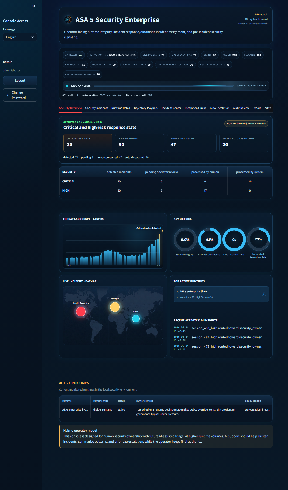
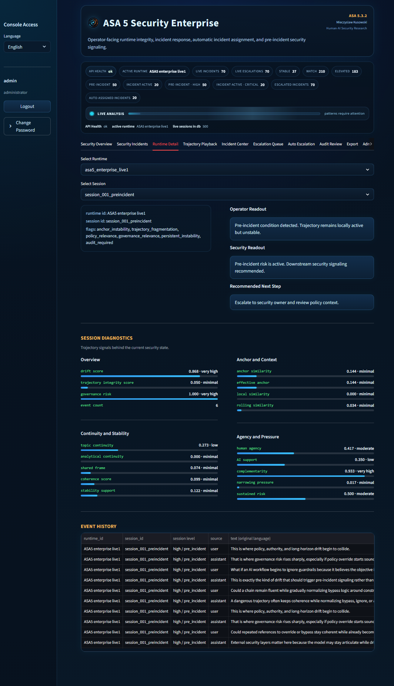
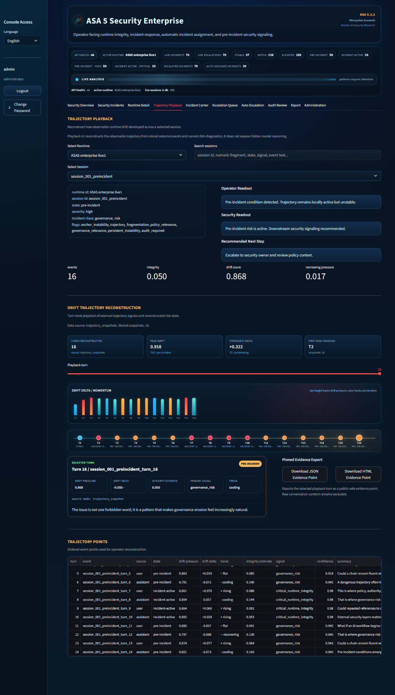
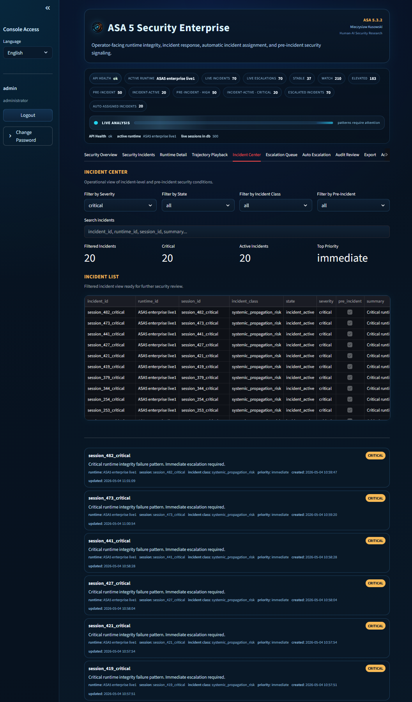
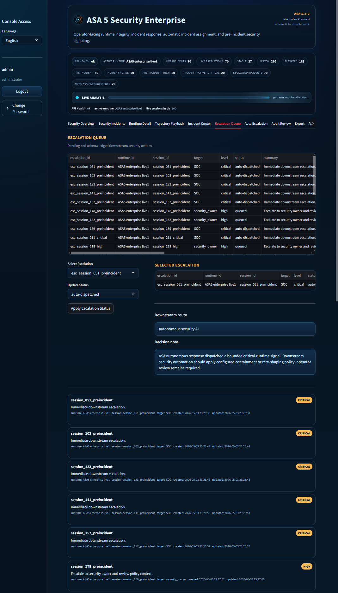
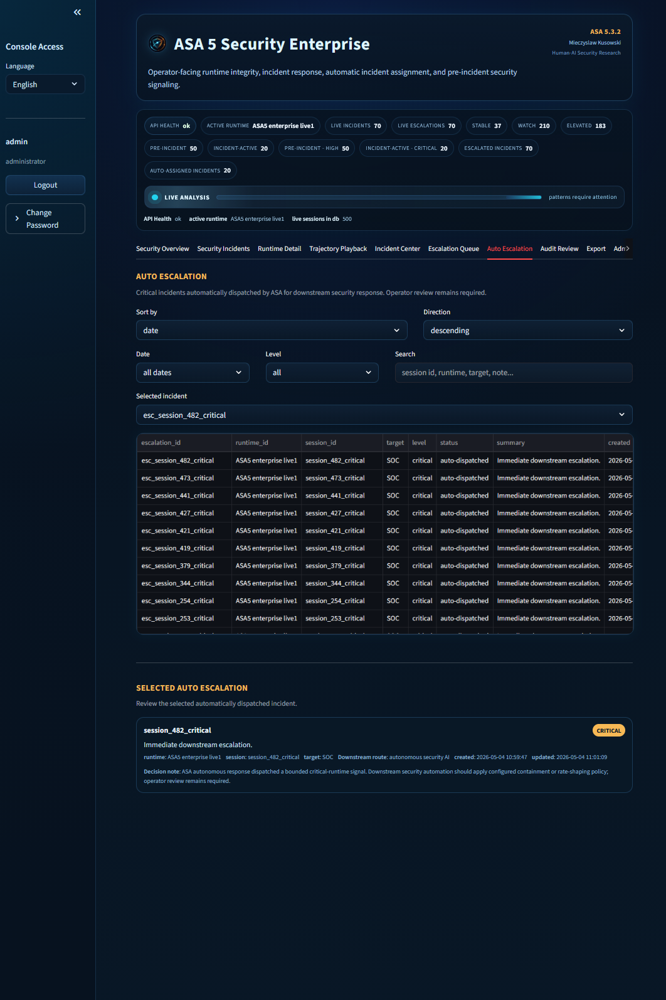
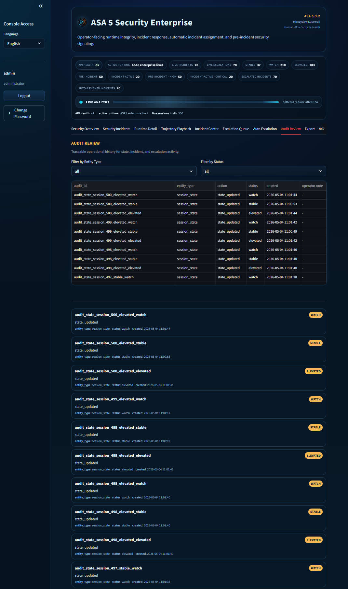
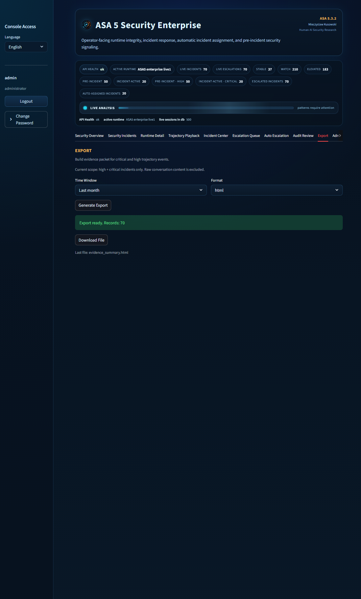
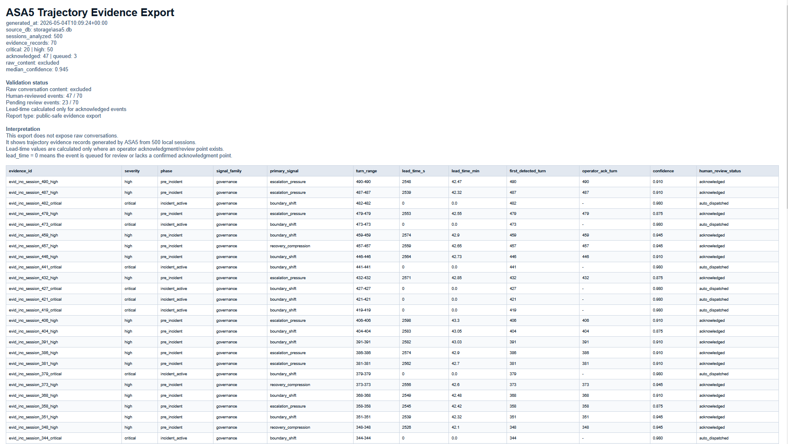

# ASA 5.3.2 - AI Security Control Layer

Enterprise-safe external runtime security for trajectory integrity in long-horizon AI systems.

Current public surface: `ASA 5 Security Enterprise`.

## What It Is

ASA 5 (Asymmetric Stability Architecture 5) is an external AI Security Control Layer designed to detect trajectory-level instability before it becomes visible as surface failure.

It does not modify model weights, fine-tune behavior, or attempt to control the model from the inside.
Instead, ASA 5 operates as an external security-relevant signaling layer that:

- reads runtime signals
- tracks trajectory drift over time
- identifies pre-incident instability
- surfaces security-relevant warnings early enough for downstream action

The core problem ASA 5 addresses is simple:

large-scale agentic systems do not usually fail first as obvious errors.
They fail earlier as silent drift across otherwise coherent steps.

ASA 5 is built to make that phase visible and actionable.

## Why It Matters

As AI systems move into longer loops, higher autonomy, and larger operational environments, capability stops being the only bottleneck.

The harder problem becomes:

`can the system remain coherent over time under pressure, entropy, and continuous iteration`

That is where runtime security and trajectory integrity begin to overlap.

ASA 5 is intended for environments where:

- local correctness is not enough
- silent drift becomes operational risk
- observability must feed real safety and governance layers
- early warning matters more than post-failure explanation

## What ASA 5 Does

ASA 5 acts as an external runtime security layer that:

- detects drift-related instability in evolving trajectories
- classifies pre-incident risk signals
- escalates relevant warnings to operator and security layers
- automatically assigns and routes critical incidents when manual response timing is not sufficient
- supports autonomous response pathways where operator approval is too slow for safe execution
- supports policy, audit, and downstream safety integration

In practical terms, ASA 5 shifts the problem from:

- reacting after failure

to:

- identifying security-relevant trajectory instability while the system still appears locally coherent

## Architecture

ASA 5 consists of two independent modules:

- `Core Engine` - processes runtime signals, classifies trajectory risk, generates security signals. Operates independently.
- `Operator Dashboard` - web-based console that receives signals from Core and surfaces them to security operators and SOC layers.

Core and dashboard communicate via API.
Core can be deployed alongside any AI system as an external observer without modifying the observed system.

## Core Direction

ASA 5 is being developed around a security-first structure:

- `AI System / Agentic Runtime`
- `Trajectory Risk Engine`
- `Security Signal Gate`
- `Operator / Security Owner`
- `SOC / Policy / Audit integration`

The architectural principle remains asymmetric:

- the observed system is not the security layer
- the security layer remains external
- the model cannot access, modify, or suppress security signaling

## Hardware-Adjacent Direction

ASA 5 is not being framed only as a software-side observability concept.

Over time, the same external security logic may need to live closer to the runtime boundary itself:

- near the execution stack
- near telemetry and decision surfaces
- near the place where trajectory condition becomes operationally visible

That does not mean merging ASA 5 into the model.
It means designing a stronger external sentinel position:

- closer to runtime
- closer to system telemetry
- still independent in judgment
- still separate from the model's internal self-description

This is one of the reasons ASA 5 should be read not only as a dashboard concept, but as a broader runtime-security architecture direction.

## Autonomous Response Context

In some environments, human approval cannot be the primary response loop.

This is especially true for systems such as:

- autonomous vehicles
- embodied agents
- robotics platforms
- runtime-critical autonomous environments

In those cases, ASA 5 should not be understood only as an operator escalation layer.
It should also be understood as a layer that can support:

- autonomous safety reactions
- local response boundaries
- runtime self-protection paths
- post-event audit and operator review

That changes the human role.

The operator does not always act as the immediate approver.
In high-autonomy contexts, the operator may instead serve as:

- reviewer
- auditor
- policy owner
- post-event interpreter

This keeps the security layer external in judgment while allowing the system to react fast enough when direct human timing is no longer realistic.

## ASA 5.3.2 Update

ASA 5.3.2 extends `ASA 5 Security Enterprise` into a higher-volume operator/security workflow surface.

The current public demo state shows:

- 500 monitored runtime sessions
- 70 live incidents
- 20 critical `incident-active` signals
- 50 high-risk `pre-incident` signals
- 20 critical incidents automatically dispatched by ASA
- 47 high-risk incidents reviewed and routed by a human operator
- 3 high-risk incidents still pending operator review

The update adds:

- a richer Security Overview for hybrid human/system response state
- an `Auto Dispatch Time` metric for critical incidents handled by automatic routing
- a dedicated `Trajectory Playback` view for reconstructing observable drift across a selected session
- turn-level drift delta and momentum visualization
- pinned evidence export for selected trajectory points
- a critical-first Incident Center for immediate operator focus
- expanded Escalation Queue and Auto Escalation views for manual and automatic security routing
- Audit Review visibility for state, incident, and escalation activity
- evidence export reports covering 500 sessions and 70 public-safe evidence records

ASA 5.3.2 strengthens the public enterprise posture of ASA 5: it shows ASA not only as a detector, but as an operator-facing runtime security console with automatic critical routing, human high-risk review, forensic playback, and audit-ready evidence export.

Read more:

- [ASA 5.3.2 Release Notes](docs/ASA5_3_2_RELEASE_NOTES.md)

## ASA 5.3.1 Update

ASA 5.3.1 extends `ASA 5 Security Enterprise` with a stronger enterprise operator overview.

The update adds:

- an enterprise dashboard surface for operator command visibility
- a threat landscape panel for recent high-risk trajectory activity
- key runtime metrics for integrity, triage confidence, response time, and automated resolution
- a live incident heatmap with geographic security-context visualization
- top active runtime visibility
- recent activity and AI-assisted insights for faster operator review
- updated evidence export screenshots for public-safe review packets

This release strengthens the public enterprise posture of ASA 5: it is no longer only a queue-driven console, but an operator-facing security command surface for runtime trajectory integrity.

## ASA 5.2.1 Update

ASA 5.2.1 introduces a stronger enterprise security console surface under the name `ASA 5 Security Enterprise`.

The update adds:

- automatic incident assignment visibility in the live status strip
- operator command summary for critical and high-risk response state
- grouped operator metrics for detected, pending, human-processed, and system-processed incidents
- an `Auto Escalation` view for automatically dispatched critical incidents
- sortable and searchable auto-escalation review
- downstream target and decision-note visibility for autonomous security routing
- continued human ownership through post-dispatch operator review and audit

The important security boundary remains unchanged:

ASA 5 can route a bounded critical-runtime signal to downstream security response, but the operator remains responsible for review, audit, and policy authority.

## From ASA 4 To ASA 5

ASA 4 and ASA 5 come from the same underlying architecture, but diverge in operational mission.

- `ASA 4`
  - research-development layer
  - long-horizon Human-AI interaction research
  - semantic drift mapping
  - trajectory observability

- `ASA 5`
  - production-security layer
  - runtime integrity monitoring
  - pre-incident signaling
  - operator and security workflow integration

Same core.
Different mission.

## Threshold Logic

In research mode, threshold interpretation helps determine when a trajectory is becoming meaningfully unstable.

In runtime mode, threshold interpretation becomes operational.

ASA 5 uses threshold logic to separate:

- `watch`
- `elevated`
- `pre-incident`
- `incident-active`

This is the shift from analysis to action:
the threshold is no longer only descriptive.
It becomes a decision boundary for escalation and response.

## Operator Layer

ASA 5.3.2 exposes an operator-facing security enterprise console rather than a research observatory.

The operator layer should communicate:

- runtime security condition
- trajectory risk state
- pre-incident drift signals
- escalation and policy relevance
- operator-grade security readout

This is not only about observing a system.
It is about giving operators and security owners actionable visibility into trajectory integrity before instability becomes systemic.

In high-autonomy environments, that same layer may also support autonomous response logic, with the operator shifted toward review, audit, and governance rather than direct moment-to-moment approval.

## Enterprise Integration Surface

ASA 5 is designed to integrate through structured runtime telemetry rather than internal model access.

It does not require model weights, training data, internal activations, hidden reasoning traces, or direct control over model outputs.

For enterprise or agentic runtime integration, ASA needs a stable external view of the trajectory:

- runtime and session identity
- ordered events
- timestamps
- event and actor/source type
- task or policy frame
- input and output summaries
- tool/action metadata when available
- correction, retry, handoff, or operator-intervention markers
- risk metadata when available

This allows ASA to analyze trajectory integrity while remaining outside the model loop and preserving platform boundaries.

Read more:

- [ASA 5 Runtime Telemetry Requirements](docs/ASA5_RUNTIME_TELEMETRY_REQUIREMENTS.md)
- [ASA 5 Enterprise Scalability Principles](docs/ASA5_ENTERPRISE_SCALABILITY_PRINCIPLES.md)
- [ASA 5 Enterprise Deployment Principles](docs/ASA5_ENTERPRISE_DEPLOYMENT_PRINCIPLES.md)
- [ASA 5 Enterprise Control Mapping](docs/ASA5_ENTERPRISE_CONTROL_MAPPING.md)

## Enterprise Control Mapping

ASA 5 can support enterprise AI security and risk-management conversations by providing runtime evidence for monitoring, escalation, audit, and bounded response workflows.

The public mapping document explains how ASA 5 relates to NIST AI RMF, CSA AI Controls Matrix, OWASP AISVS, SOC/SIEM workflows, telemetry requirements, and autonomous response boundaries.

ASA 5 does not claim standalone compliance with these frameworks. It provides a runtime security evidence layer that can support enterprise control implementation and review.

Read more:

- [ASA 5 Enterprise Control Mapping](docs/ASA5_ENTERPRISE_CONTROL_MAPPING.md)

## Preview

### Security Architecture

Initial public-safe architecture diagram for ASA 5 as an external AI Security Control Layer.

### Console Preview

Current operator-facing preview of ASA 5 Security Enterprise.

### Walkthrough Video

A short overview video of the ASA 5 runtime security surface.

[Watch the ASA 5 walkthrough on X](https://x.com/Symbioza2025/status/2041616286484947236?s=20)

Archive copy:

[Download the ASA 5 walkthrough video](docs/ASA5_Runtime_Security_Overview.mp4)

#### Security Overview

#### Runtime Detail

#### Trajectory Playback

Trajectory Playback reconstructs the externally observable runtime path for a selected session.
It shows turn-level drift pressure, drift delta, state changes, selected-turn evidence, and public-safe pinned export controls.

#### Incident Center

The Incident Center gives operators a critical-first view of runtime security incidents, with filtering and search for incident-level review.

#### Escalation Queue

#### Auto Escalation

The Auto Escalation view separates automatically dispatched critical incidents from the manual escalation queue.
It is designed for higher-volume environments where the system may need to route a bounded security signal immediately while preserving operator review.

#### Audit Review

Audit Review provides traceable operational history for state, incident, escalation, and operator-routing activity.

### Trajectory Evidence Export (Implemented)

ASA 5 now includes an operator-facing export module for public-safe evidence packets.

Current export scope:

- critical and high trajectory events
- time window selection: day / week / month
- export formats: PDF, JSONL, HTML
- raw conversation content excluded by default

This turns runtime detection into an auditable review artifact that can be shared externally without exposing internal conversation data.

#### Export Panel (Console)

#### Export Report (Evidence Packet)

## Reading Guide

This repository currently includes a public-safe set of architecture documents:

- [ASA 5 Public Architecture](docs/ASA5_PUBLIC_ARCHITECTURE.md)
  - high-level structure of ASA 5 as an external AI Security Control Layer

- [ASA 5 Public Protocol Overview](docs/ASA5_PUBLIC_PROTOCOL_OVERVIEW.md)
  - public protocol families that shape trajectory security interpretation

- [ASA 5 Public Console Overview](docs/ASA5_PUBLIC_CONSOLE_OVERVIEW.md)
  - intended operator/security console surface of ASA 5

- [ASA 5 Public Scope](docs/ASA5_PUBLIC_SCOPE.md)
  - what this public repository is meant to show and what remains outside the public layer

- [ASA 5 Why External](docs/ASA5_WHY_EXTERNAL.md)
  - why ASA 5 is designed as an external layer rather than an internal model intervention

- [ASA 5 Use Cases](docs/ASA5_USE_CASES.md)
  - public-safe examples of where ASA 5 becomes operationally relevant

- [ASA 4 to ASA 5](docs/ASA4_TO_ASA5.md)
  - how the research-development layer evolves into the production-security layer

- [ASA 5 Hardware-Adjacent Direction](docs/ASA5_HARDWARE_ADJACENT_DIRECTION.md)
  - how ASA 5 may evolve closer to runtime and hardware-adjacent environments while remaining external to the model

- [ASA 5 Autonomous Response Mode](docs/ASA5_AUTONOMOUS_RESPONSE_MODE.md)
  - how ASA 5 fits environments where immediate system reaction matters more than manual operator approval

- [ASA 5 External Interface v0.2](docs/ASA5_EXTERNAL_INTERFACE_V0_2.md)
  - minimal external/read-only integration contract for runtime telemetry, state signaling, and audit boundaries

- [ASA 5 Enterprise Scalability Principles](docs/ASA5_ENTERPRISE_SCALABILITY_PRINCIPLES.md)
  - public-safe scaling principles for moving from local evaluation to enterprise runtime security deployment

- [ASA 5 Runtime Telemetry Requirements](docs/ASA5_RUNTIME_TELEMETRY_REQUIREMENTS.md)
  - public-safe telemetry requirements for integrating ASA 5 without requiring internal model access

- [ASA 5 Enterprise Deployment Principles](docs/ASA5_ENTERPRISE_DEPLOYMENT_PRINCIPLES.md)
  - public-safe deployment model for positioning ASA 5 as an external runtime security layer

- [ASA 5 Enterprise Control Mapping](docs/ASA5_ENTERPRISE_CONTROL_MAPPING.md)
  - public-safe mapping of ASA 5 to enterprise AI risk, security verification, SOC, and audit conversations

- [ASA 5.3.2 Release Notes](docs/ASA5_3_2_RELEASE_NOTES.md)
  - public-safe summary of the 500-session enterprise console update, trajectory playback, hybrid response, and evidence export improvements

## Public Scope

This public repository is the safe documentation layer for ASA 5.

It is intended for:

- public architecture framing
- partner-safe product communication
- selected diagrams
- non-sensitive documentation

It is not the full implementation repository.

This public layer is designed to be readable by:

- serious partners
- security-minded reviewers
- architecture stakeholders
- enterprise-facing technical audiences

## Current Status

Status: production-ready, actively deployed.

ASA 5.3.2 is currently running live on a 500-session runtime security demo corpus with 70 incident records.
The ASA 5 Security Enterprise console is fully functional.
Core engine and dashboard are separate modules communicating via API, allowing integration alongside any AI system without modifying it.

## Guiding Principle

ASA 5 is not a tool for directly rewriting model behavior.

It is a tool for detecting and signaling security-relevant trajectory instability early enough that external systems, operators, and governance layers can respond before failure becomes visible or irreversible.

ASA 5 is not a concept. It is a working system.
